# Groove Box TV

A retro "cable TV" display for an analog stereo (repo: `stereo-tv`). A Raspberry Pi drives a CRT or
small monitor with fake cable channels whose content follows whatever record is
playing, identified automatically from a line-in feed.

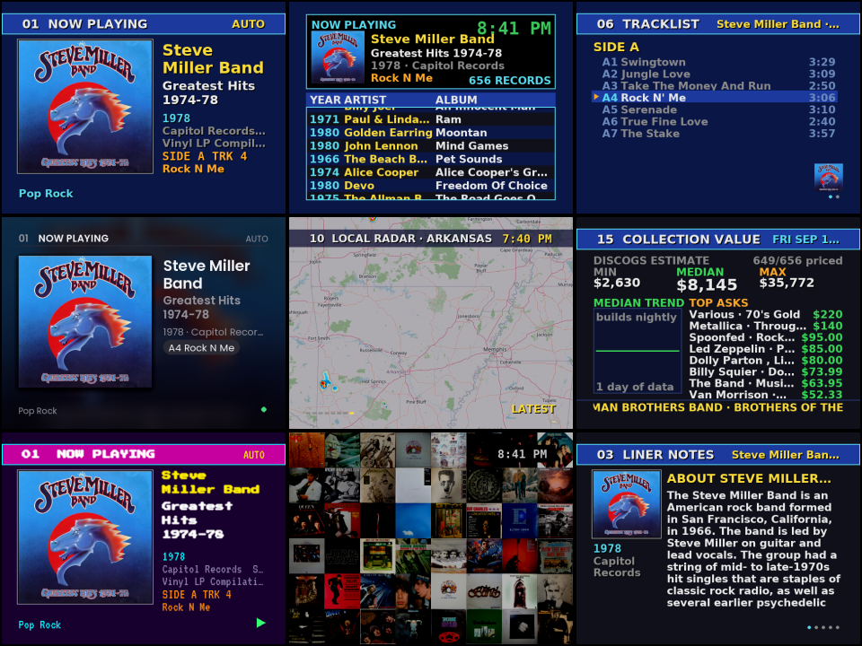

Ten themes, from late-80s cable to modern dark and light:

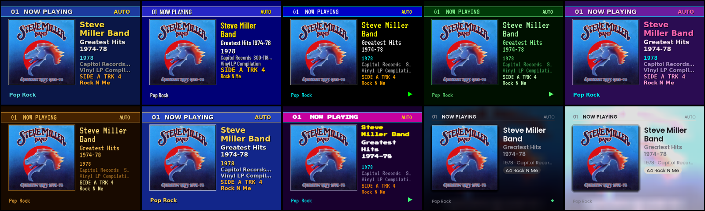

**What it does**

- Listens to your stereo (USB line-in), fingerprints the audio with Shazam, and
  resolves the match to *your* pressing in your Discogs collection — side and
  track included.
- 16 channels: Now Playing, Visualizer, Liner Notes (Wikipedia + Discogs notes),
  In Your Collection, Prevue-style Guide, Tracklist, Collection Stats, Random
  Spin, Personnel, Local Radar, Weather, System Status, Music News, This Day in
  Music, Collection Value, Test Pattern.
- Screensavers when the music stops: cover wall, flying covers, "Local on the 8s"
  weather, bouncing cover.
- A phone page to search the collection and override what's showing.
- Optional wired touchscreen remote (ESP32 "CYD"), see `remote/cyd/`.

Designed for 640×480 at 30 fps on a Pi 3: big fonts, 4:3, safe margins, no desktop. On a 16:9 monitor the
canvas is GPU-scaled with side bars, or set an 854×480 canvas in the wizard to fill the screen.

## The channels

| | | |
|---|---|---|
| 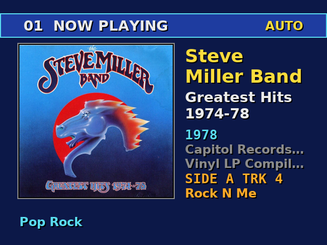 **1 Now Playing** — cover, artist, album, year, label, side/track from auto-ID | 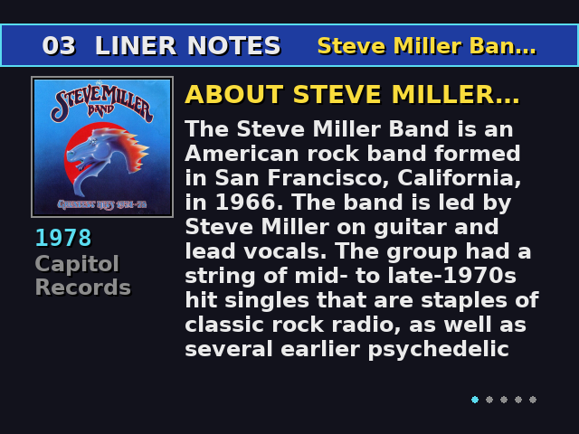 **3 Liner Notes** — Wikipedia artist + album summaries, Discogs pressing notes | 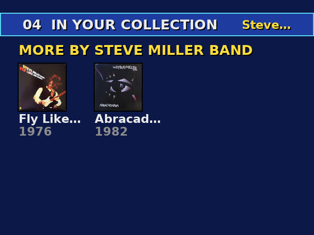 **4 In Your Collection** — more by the artist, same label, same style |
| 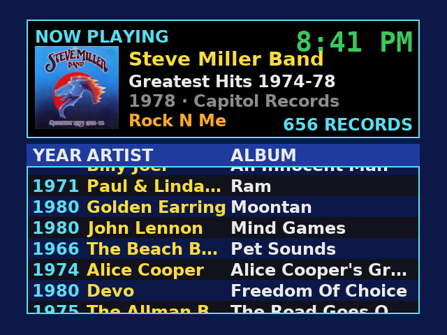 **5 Guide** — Prevue-style scrolling listing of the whole collection | 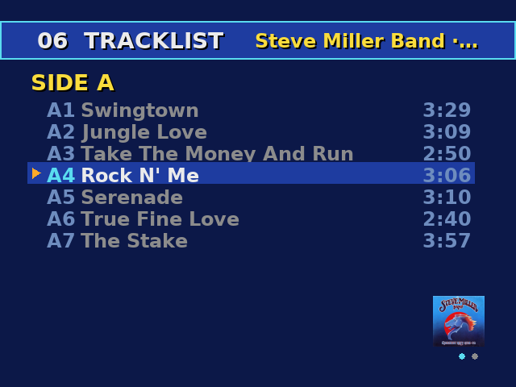 **6 Tracklist** — the side that's playing, current track highlighted | 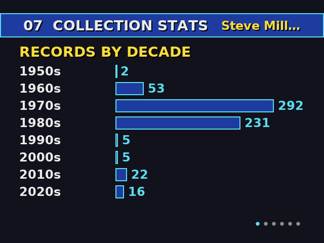 **7 Collection Stats** — by decade, top artists, labels, styles |
| 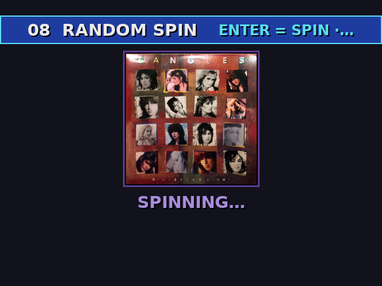 **8 Random Spin** — slot-machine picker; Enter re-spins, P plays it |  **9 Personnel** — who played on the record | 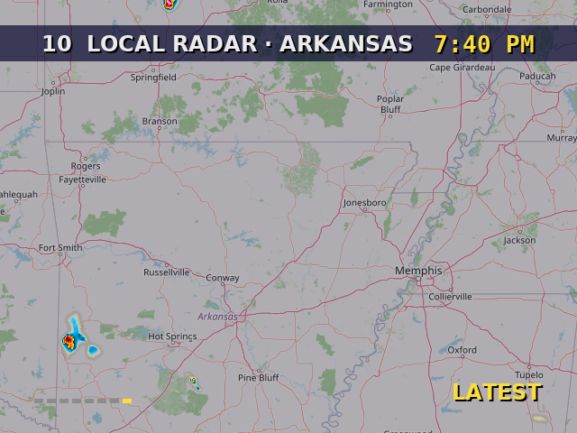 **10 Local Radar** — RainViewer over OpenStreetMap, animated |
| 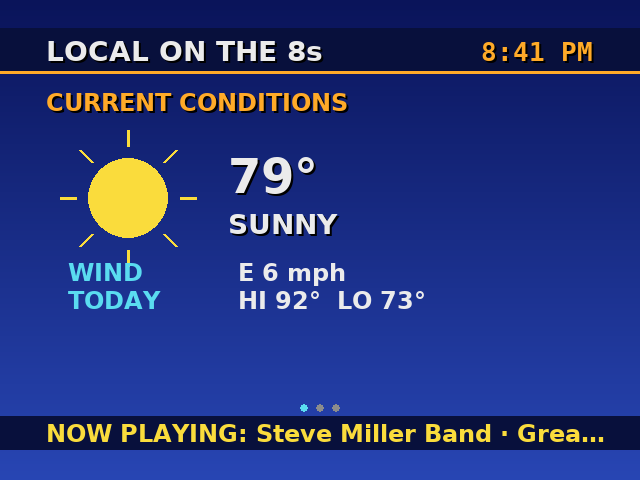 **11 Weather** — "Local on the 8s": current, 5-day, radar | 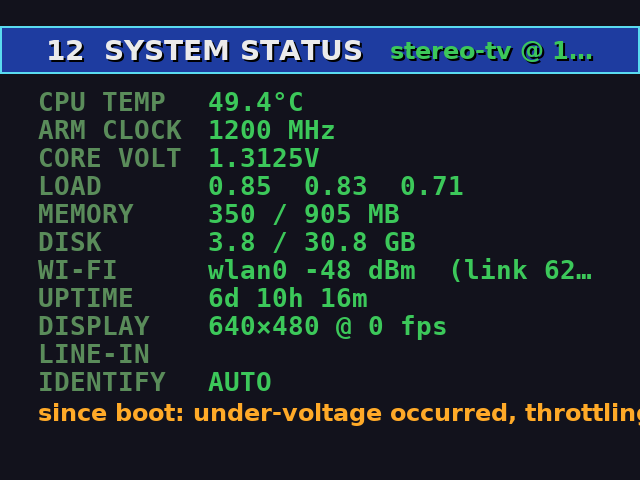 **12 System Status** — temps, clocks, throttle flags, Wi-Fi, fps |  **13 Music News** — RSS headlines (Pitchfork, Rolling Stone, …) |
| 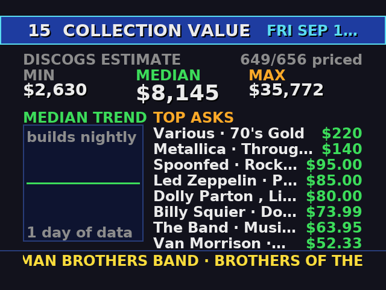 **15 Collection Value** — Discogs estimates as an 80s financial channel | 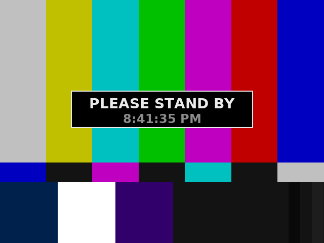 **16 Test Pattern** — SMPTE bars and a convergence grid | 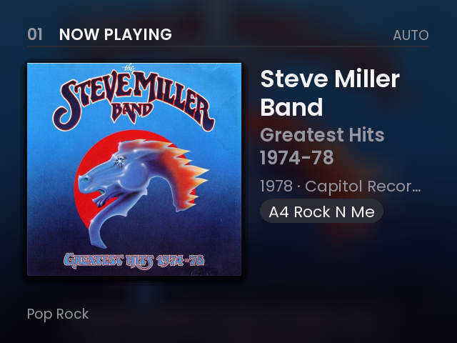 **Modern Dark** — the same Now Playing in the modern layout |

2 is the visualizer (spectrum + scope from the line-in) and 14 is This Day in Music (your records released on this date).

Screensavers when the music stops: cover wall, flying covers, Local on the 8s weather, bouncing cover.

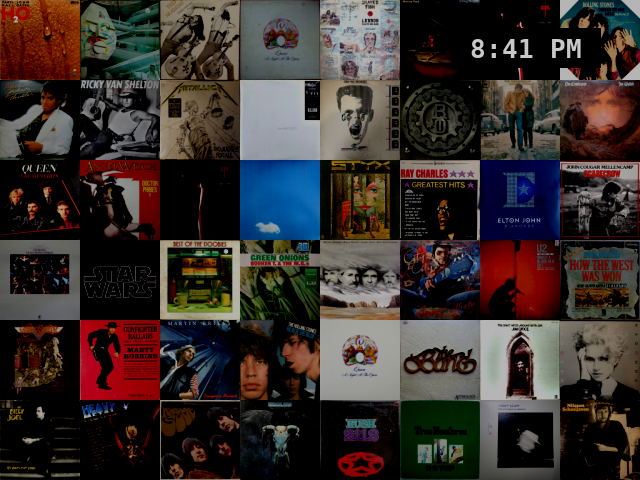

## Hardware

- Raspberry Pi 3 or newer, Raspberry Pi OS Lite (64-bit, Bookworm or Trixie).
- A display: any HDMI monitor/TV. A VGA CRT via an HDMI→VGA adapter looks great.
- A USB **line-level** audio input fed from your amp's **tape out / rec out**: a Behringer UCA202,
  a "USB audio capture / cassette-to-MP3" grabber with RCA inputs, or any class-compliant interface.
  Avoid headset-style USB dongles: their mic input is telephone bandwidth (nothing above ~4–8 kHz),
  which cripples song recognition.
- Optional: an ESP32-2432S028 "Cheap Yellow Display" as a wired remote.

## Install

Before you start you need a **Discogs personal access token**: Discogs → Settings → Developers →
"Generate new token". The wizard asks for it and verifies it.

### On a Raspberry Pi

As the user that will run it (Raspberry Pi OS Lite may need `sudo apt install git` first):

```bash
git clone https://github.com/arblazer2/stereo-tv.git ~/stereo-tv
cd ~/stereo-tv
deploy/install.sh              # apt deps, venv, groups, systemd units (asks for sudo)
.venv/bin/python -m stereotv.setup    # Discogs token, location, audio device, weather; first sync
sudo systemctl start stereo-tv
journalctl -u stereo-tv -f
```

The wizard asks for:

- your Discogs username and token, verified on the spot;
- a ZIP / postal code or "City, ST" — geocoded for the radar and weather;
- which audio capture device to use (it lists what's plugged in) and whether it's stereo or mono;
- a weather source: Open-Meteo (free, no key) or Home Assistant;
- your display (`crt` for 4:3, `wide` for a 16:9 monitor) and a starting theme.

Press Enter to accept the default shown in brackets.

The first sync pulls your collection, cover art, tracklists and release notes
(a few minutes per few hundred records; Discogs allows 60 requests/minute).
A nightly timer keeps everything fresh and adds original release dates
(MusicBrainz), Wikipedia summaries and marketplace values.

If the screen stays black on a Pi with the KMS driver, add
`video=HDMI-A-1:640x480@60D` to `/boot/firmware/cmdline.txt` — see `docs/PI-NOTES.md`.

### On a PC or Mac

No Pi required to try it, or to run it for real off a desktop's line-in.

**Windows** (no Python install needed):

1. Click the green **Code** button → **Download ZIP**, and unzip it. You get a folder called
   `stereo-tv-main`; put it anywhere, e.g. `C:\Users\you\stereo-tv`.
2. Open its `windows` folder and double-click **`stereo-tv.cmd`**. The first run downloads a private,
   portable Python into the folder (no system install, no admin), installs the dependencies, and walks
   you through the same setup wizard. If Windows shows a SmartScreen prompt, choose "Run anyway".
3. It opens in a window. Pick the input your stereo is connected to (a USB audio interface, or the
   blue line-in jack on a sound card); answer `wide` to the display question for a 16:9 monitor.
4. To update later: download the ZIP again and copy it over the folder, skipping the `python` subfolder.

**Linux / macOS:**

```bash
git clone https://github.com/arblazer2/stereo-tv.git && cd stereo-tv
scripts/run.sh          # first run creates .venv, installs deps, runs the wizard, then starts windowed
```

Config lives in `%APPDATA%\stereo-tv` on Windows, `~/Library/Application Support/stereo-tv` on macOS,
`~/.config/stereo-tv` on Linux. WSL is not a good host: it has no audio input devices.
For a demo without any audio hardware set `[audio] device = "file:/path/to/song.wav"` — the identifier and
visualizer run on the file as if it were the line-in. The CYD remote works on a PC too (it's just a COM port).

## Using it

- Keyboard: **←/→ or 1–9, 0** change channel · **Space** screensaver (again = next) ·
  **T** cycle themes (Cable '88, Prevue, Teletext, Phosphor, Vaporwave, Amber, Weather '95, Arcade, Modern Dark, Modern Light, Commodore 64) · **S** scanlines · **Q** quit (systemd restarts it). On channel 8: **Enter** re-spin, **P** play it. On channel 2: **V** or **Enter** cycles the visualizer
  (spectrum, VU meters, XY scope, waterfall).
- Phone: `http://<pi>:8080/` — search, tap a record to override auto-ID for 30 min. Use this for
  records the fingerprint services don't know: **Shazam recognises studio recordings and misses many live
  albums and deep cuts**. An optional AcoustID key (`config.example.toml`) adds a second opinion at the end
  of each track.
- API: `GET /api/now`, `GET /api/audio` (input level, for gain tuning),
  `POST /api/channel?channel=N`, `POST /api/screensaver?mode=wall`.
- Config lives in `~/.config/stereo-tv/config.toml`; `config.example.toml` documents every key.

## Layout

```
stereotv/main.py         loop, channel registry, dial/keyboard, screensaver
stereotv/display.py      pygame/kmsdrm init, fonts, CRT effects, burn-in drift
stereotv/audio.py        arecord → ring buffer shared by identify + visualizer
stereotv/identify.py     silence/audio state machine → Shazam → collection match → track clock
stereotv/discogs.py      collection sync, covers, tracklists, notes, market values (SQLite)
stereotv/wiki.py         Wikipedia summaries      stereotv/musicbrainz.py  original release dates
stereotv/weather.py      Open-Meteo / HA          stereotv/radar.py        RainViewer + OSM tiles
stereotv/web.py          phone page + API         stereotv/remote.py       USB serial remote
stereotv/channels/       one file per channel     stereotv/screensaver.py  the savers
remote/cyd/              ESP32 touchscreen remote firmware
deploy/                  systemd units + installer
```

## Credits / data sources

Discogs API · Shazam (via shazamio) · Wikipedia REST API · MusicBrainz ·
Open-Meteo · RainViewer · OpenStreetMap tiles · RSS feeds from Pitchfork,
Rolling Stone, Stereogum and NME. Please keep a real contact in `[app] contact`
— several of these ask for one in the User-Agent.

MIT license.
